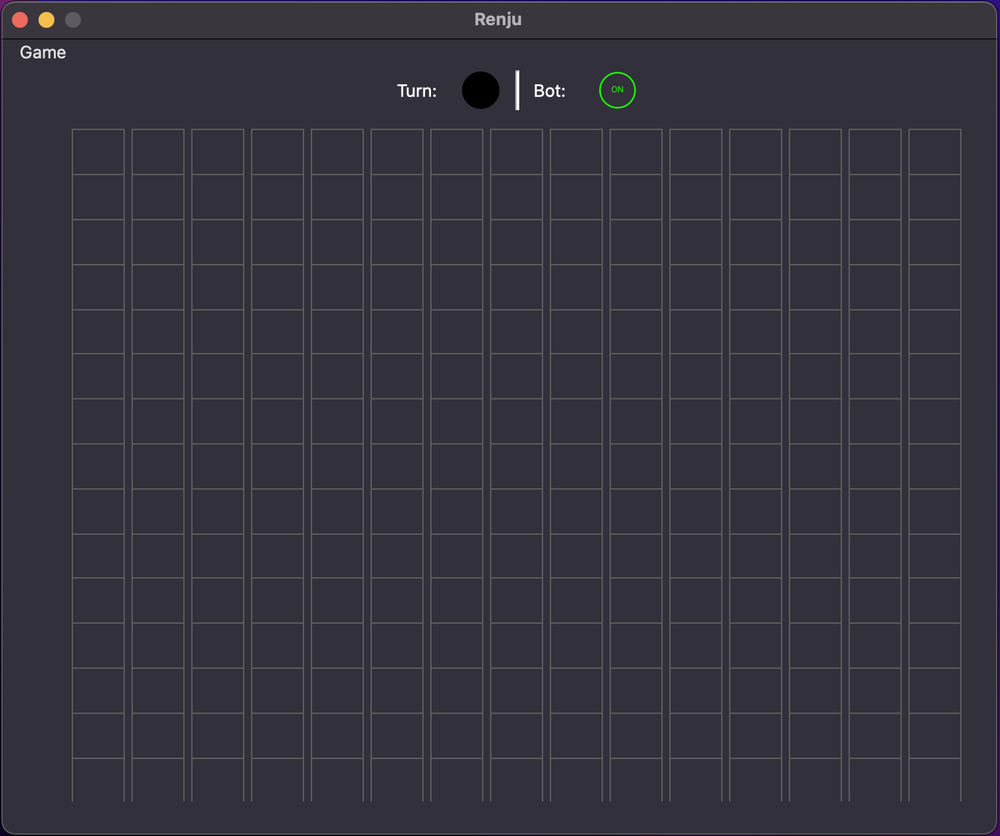

# PyRenju
<p>Qt project yandex lyceum</p>

<div id="badges">
  <a href="https://github.com/FlamesC0der/discord-bot-template/stargazers"></a>
  <a href="https://github.com/FlamesC0der/discord-bot-template/blob/master/LICENSE"></a>
</div>

##

<p>Renju game using PyQt6</p>

## [RU Description](https://github.com/FlamesC0der/PyRenju/blob/master/description.md)

##



## Features

* Bot
* multiplayer
* Ability to rewind moves
* Material design
* Icons
* About page

## Installation

* Install using
```
git clone https://github.com/FlamesC0der/PyRenju.git
```
* Install requirements from requirements.txt
```
pip install -r requirements.txt
```
* Run via
```
python main.py
```
