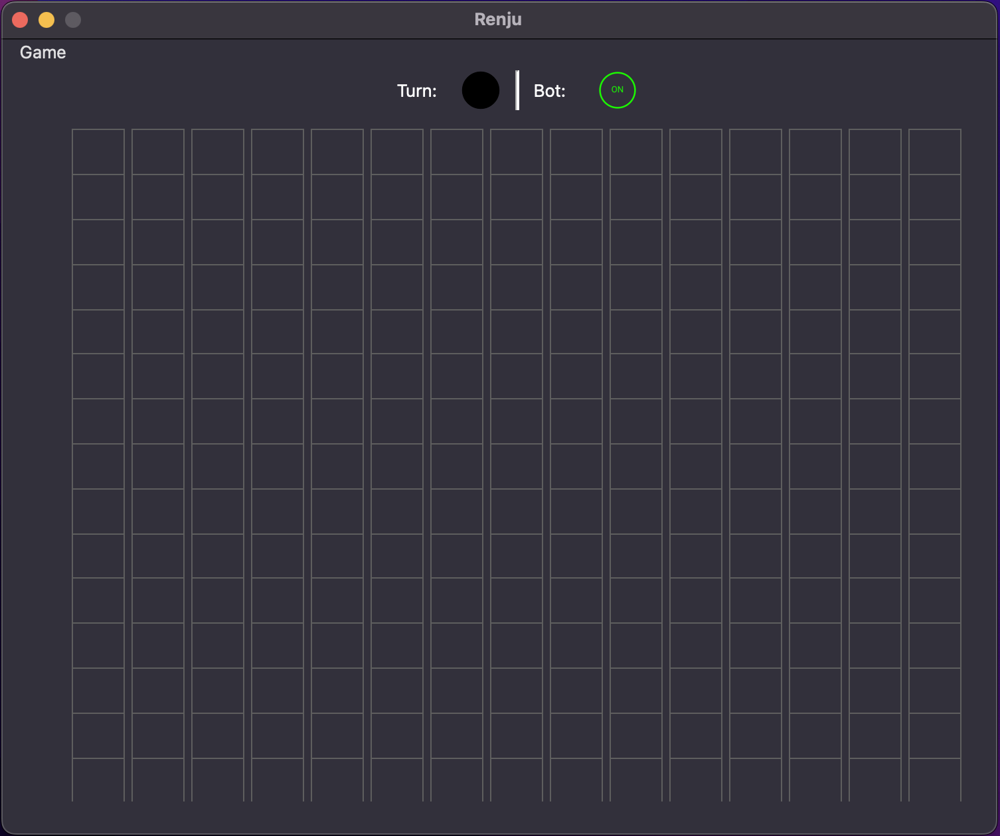
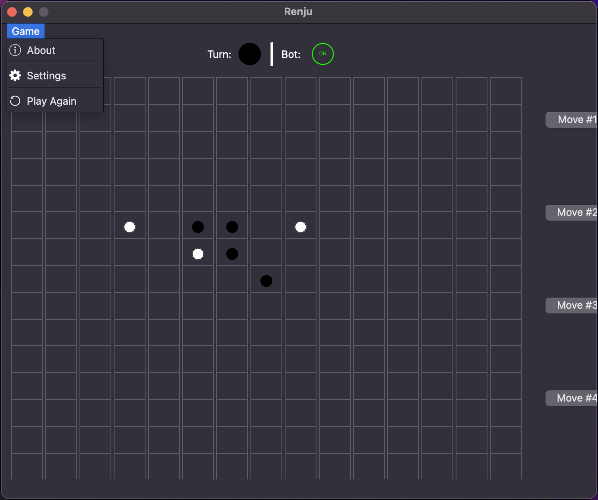
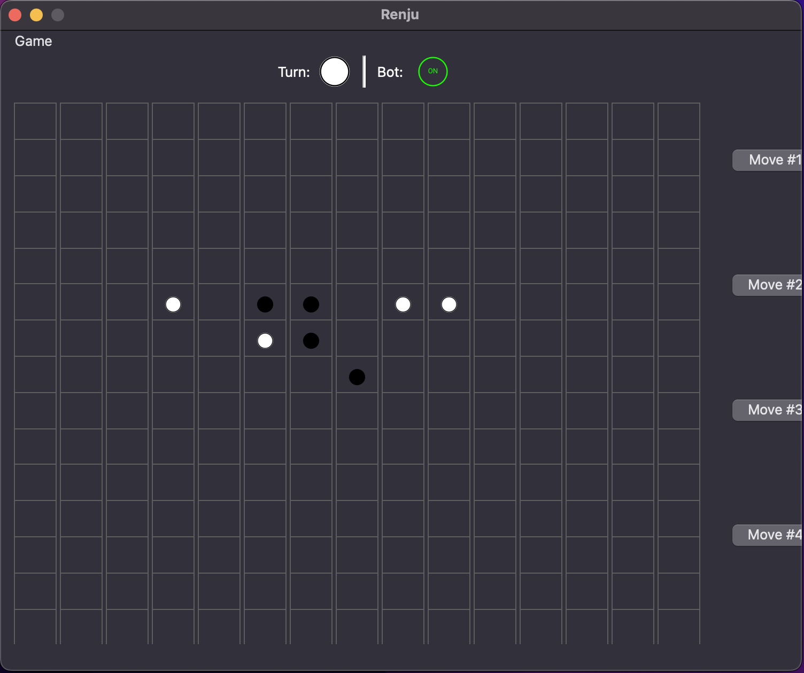
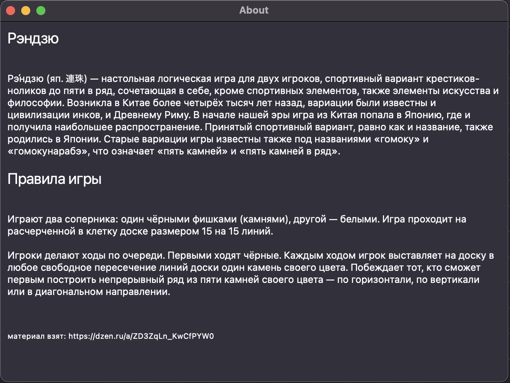
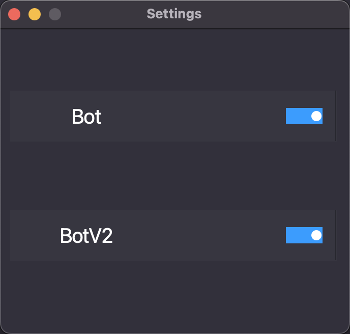

<h1>Описание проекта</h1>

<h2>введение</h2>

Данное приложение было создано для игры в игру рэндзю (連珠)

Рэ́ндзю (яп. 連珠) — настольная логическая игра для двух игроков, спортивный вариант крестиков-ноликов до пяти в ряд, сочетающая в себе, кроме спортивных элементов, также элементы искусства и философии. Возникла в Китае более четырёх тысяч лет назад, вариации были известны и цивилизации инков, и Древнему Риму. В начале нашей эры игра из Китая попала в Японию, где и получила наибольшее распространение. Принятый спортивный вариант, равно как и название, также родились в Японии. Старые вариации игры известны также под названиями «гомоку» и «гомокунарабэ», что означает «пять камней» и «пять камней в ряд».

<h2>Описание работы компонентов программы</h2>

При запуске приложения появляется основное окно программы. По середине находится игровое поле 15 на 15. Вверху находятся индикаторы хода и статуса бота. При игре справа появляется история ходов, с возможностью переметки. В левом верхнем углу при нажатии на "Game" открывается меню с кнопками: 

* About
* Settings
* Play again

<h2>SQLITE (БД)</h2>
В БД находится одна таблица matrix\
Таблица matrix содержит в себе матрицу доски (matrix) и номер хода (move).

<h2>скриншоты</h2>

* #### Главное окно

* #### Главное окно 2

* #### Главное окно 3

* #### Страница About

* #### страница Настроек

<h2>Библиотеки</h2>

* #### PyQt6 (для UI)
